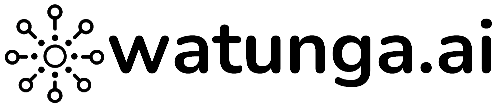

# Watunga AI Multi-Agent Framework



## Public Demo

[Public Demo of this Watunga App](https://watunga001.streamlit.app/)

## Overview

The Watunga AI Multi-Agent Framework is a comprehensive platform designed to create, assemble, and reuse AI agents and tools. This Streamlit-based application provides a user-friendly interface for interacting with AI agents and visualizing their capabilities.

## Mission

We aim to create an AI-Multi-Agent-Framework for an AI-Fabric with reusable AI-Agents and reusable Tools. Our platform includes a Creation Tool (Genesis) for creating, assembling, and reusing AI-Agents and Tools.

## Vision

We believe the future of work lies in the collaboration between humans and machines. Our AI platform and agents are designed to optimize business processes, scale automation, and free teams to focus on strategic decisions. We strive to fundamentally change how work is done by leveraging innovative AI platform technologies to increase productivity and maximize efficiency.

## Key Components

### 🤖 Agents

Autonomous units specialized to perform specific tasks. Each agent has a defined goal and can interact with other agents or tools. Agents process information, make decisions, and perform actions based on their mandate.

### 🛠️ Tools

Specialized modules used by agents to perform tasks. Each tool provides a specific function, such as retrieving data, performing calculations, or communicating with APIs. Tools are implemented in Python with a defined run method and are designed to be reusable across multiple agents.

### 🔅 Agencies

Groups of agents working together to achieve a common goal. Each agency specializes in a specific task or business process with clearly defined agent roles. Agents within an agency can share tools and learn from each other.

### 🌱 Genesis

The process by which new agents or agencies are created. Genesis determines the basic structure and behavior of agents by defining parameters such as tasks and tools. It can access existing agents, tools, and agencies to create new combinations, and develops missing components when needed.

## Application Structure

- **Home.py**: Main entry point of the application
- **config_wa.py**: Configuration settings for the application
- **utils/**: Utility classes and functions
  - **class_wa.py**: Core utility class with helper methods
  - **layout_wa.py**: Layout management for the Streamlit UI
- **pages/**: Individual application pages
  - **01_Template_3columns.py**: Template for three-column layout
  - **10_About_Watunga.py**: Information about the Watunga framework
- **styles/**: CSS styling
  - **main.css**: Main stylesheet for the application
- **assets/**: Images and other static assets

## Features

- Three-column responsive layout with collapsible panels
- Consistent styling and branding
- Modular architecture for easy extension
- Information about the Watunga framework and its components

## Installation

1. Clone the repository:
   ```
   git clone <repository-url>
   cd streamlit_app_bp2
   ```

2. Install the required dependencies:
   ```
   pip install -r requirements.txt
   ```

3. Run the application:
   ```
   streamlit run Home.py
   ```

## Requirements

This application requires:
- streamlit
- streamlit-extras

## Development

To extend the application with new pages:
1. Create a new Python file in the `pages/` directory
2. Use the template from `01_Template_3columns.py` as a starting point
3. Implement the `left_content()`, `middle_content()`, and `right_content()` functions
4. Use the `layout_wa()` function to build the page

## About Watunga

**Watunga** - *noun, masculine [Swahili]*

**Definition:**
1. (plural) builder, creator, designer
2. People who create or design something, especially in connection with the construction or creation of physical or abstract objects.

**Origin:** Derived from the Swahili verb root "-tunga," meaning "to create" or "to form."

**Watunga** literally means "the builders" or "the creators" (in the plural), where "wa-" indicates the plural of persons and "-tunga" denotes the act of creation.

## License

[Specify license information]

## Contact

For more information, visit [Watunga](https://www.watunga.com/) or contact us at [ai@zechmann.de](mailto:ai@zechmann.de).